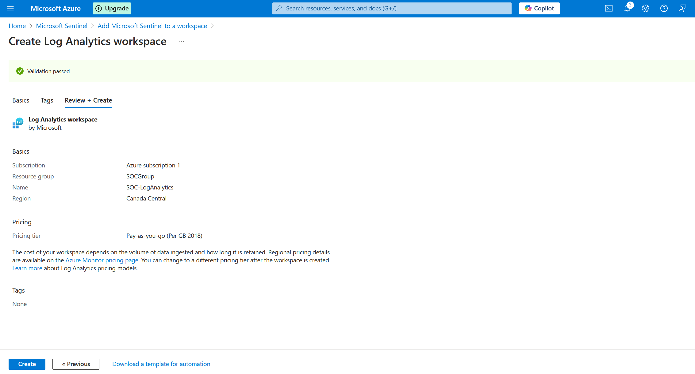
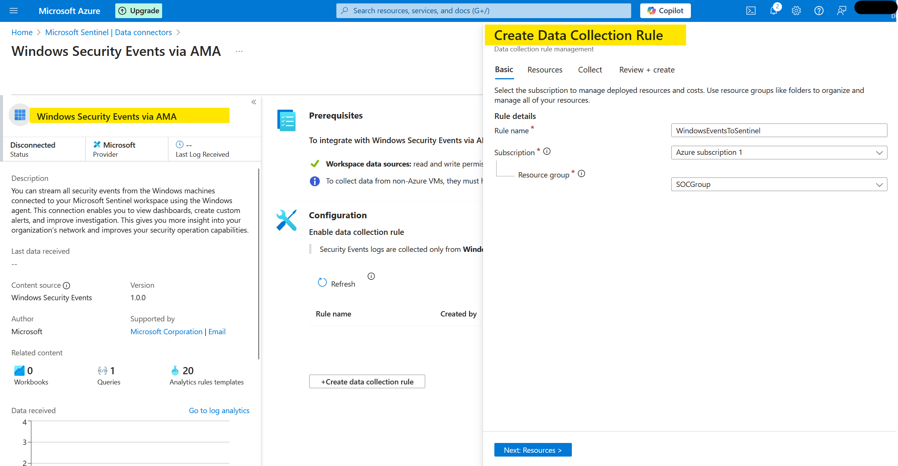
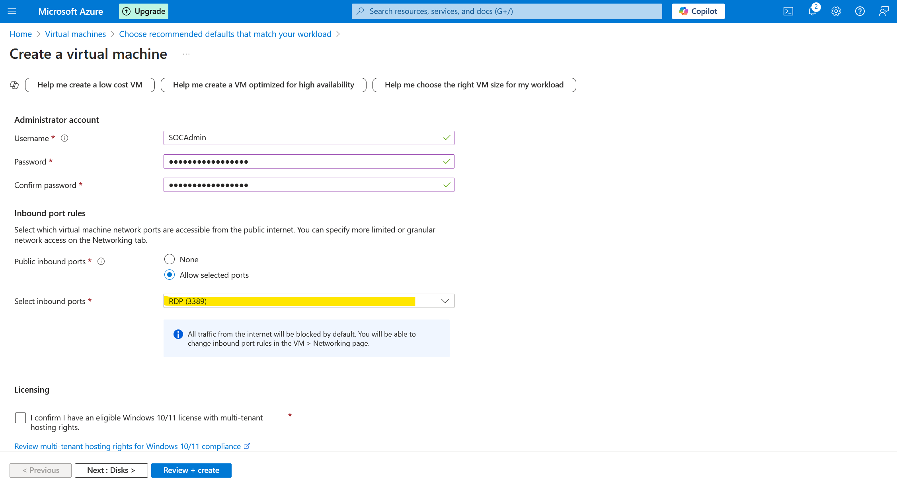
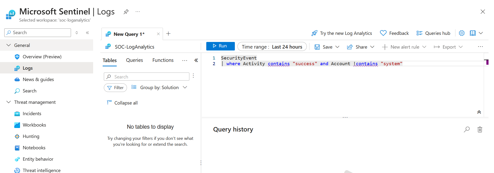
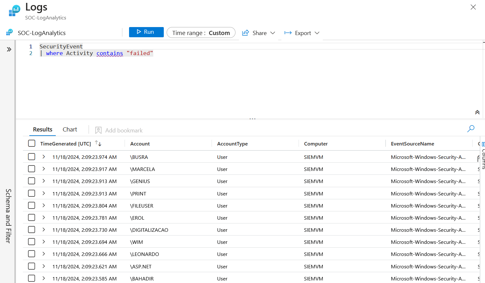

# SOC on Cloud Project
This project demonstrates the setup of a Security Information and Event Management (SIEM) system using Azure Sentinel service that monitors Remote Desktop Protocol (RDP) events.
The goal was to log successful RDP logins and analyze them using KQL (Kusto Query Language) Queries.

## Features
- **Azure Sentinel Configuration**: Monitors security events on connected virtual machines.
- **Log Analytics Workspace**: Collects and organizes security logs.
- **Azure Monitor Agent**: Streams logs from virtual machines to Azure Sentinel.
- **Custom KQL Queries**: Filters and analyzes log data.

-----

## Steps

### 1. **Create Log Analytics Workspace for Azure Sentinel**
A Log Analytics Workspace was set up to store security logs for analysis.


---

### 2. **Configure Azure Sentinel**
Azure Sentinel was configured to receive and analyze data from the Log Analytics Workspace.


---

### 3. **Configure Windows Security Events Data Collection**
Data was collected using the Azure Monitor Agent (AMA). This was installed from the Content Hub while navigating through the Data Connector tab of Azure Sentinel.


---

### 4. **Set Up Virtual Machine and Enable RDP**
A virtual machine with RDP enabled was created.


---

### 5. **Logs for Successful Signin**
An alert was created for the logs containing successful RDP sign-ins that were queried using KQL.



```kql
SecurityEvent
| where Activity contains "success" and Account !contains "system"
```
---

### 6. **Logs for Failed Sign Ins**
An alert was created for the logs containing failed RDP sign-ins queried using KQL.



```kql
SecurityEvent
| where Activity contains "failed"
```
---

### 7. **Azure Sentinel Overview**
An overview of the logs that were recorded is demonstrated in the image.


---
## Results
The system successfully logged RDP events, which could be visualized in Azure Sentinel. This demonstrates the practical use of a cloud-based SIEM for monitoring and security.
